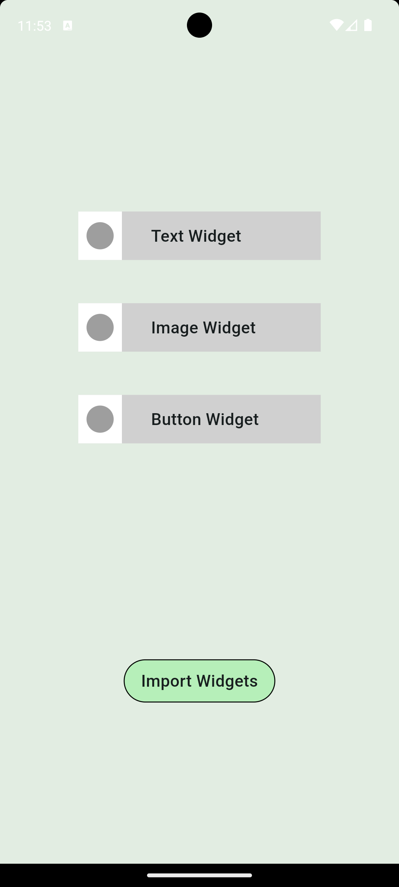

# Ubixstar Assignment App

Ubixstar assignment app built using Flutter and Firebase.

## Features

- **Home Screen**: Displays all the widgets that the user adds. The user will be routed to the Widget selection screen when clicking the Add Widget button.
- **Widget Selection Screen**: User can import a widget, by clicking on it. When clicking the Import widgets button, the selected widgets get imported to the home screen. 

## State Management
The entire app state is managed using `Provider`.

## Screenshots

